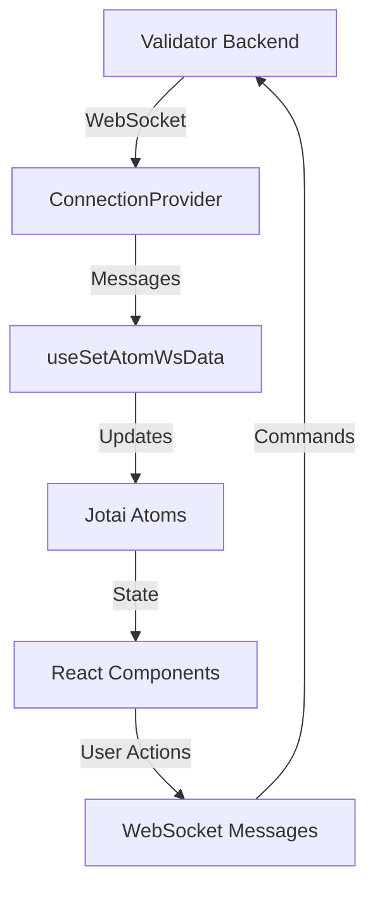

The Firedancer Frontend is a React-based monitoring dashboard for Firedancer and Frankendancer Solana validators. It provides real-time insights into validator performance, network metrics, and slot processing.

## Technology Stack

The application is built with modern web technologies optimized for performance:

<CardGroup cols={2}>
  <Card title="React 18" icon="react">
    Modern React with hooks and concurrent features
  </Card>
  <Card title="Vite" icon="bolt">
    Fast build tool with hot module replacement
  </Card>
  <Card title="TypeScript" icon="code">
    Type-safe development with strict mode enabled
  </Card>
  <Card title="TanStack Router" icon="route">
    Type-safe, file-based routing
  </Card>
</CardGroup>

### Core Dependencies

```json package.json
{
  "dependencies": {
    "react": "^18.3.1",
    "@tanstack/react-router": "^1.114.25",
    "jotai": "^2.10.0",
    "@radix-ui/themes": "^3.1.3",
    "@ag-grid-community/react": "^32.2.0",
    "@oneidentity/zstd-js": "^1.0.3"
  }
}
```

## High-Level Architecture

The frontend follows a unidirectional data flow pattern with real-time WebSocket updates:



### Data Flow

1. **WebSocket Connection**: Established via `ConnectionProvider` on app initialization
2. **Message Parsing**: Incoming messages are validated with Zod schemas
3. **State Updates**: Parsed data updates Jotai atoms
4. **Component Rendering**: Components subscribe to atoms and re-render on changes
5. **User Interactions**: User actions send commands back through WebSocket

## Project Structure

```bash
src/
├── api/               # API layer and WebSocket integration
│   ├── ws/           # WebSocket connection management
│   ├── atoms.ts      # API-related state atoms
│   ├── entities.ts   # Zod schemas for data validation
│   └── types.ts      # TypeScript type definitions
├── atoms.ts          # Global application state
├── atomUtils.ts      # Utility functions for atoms
├── components/       # Reusable UI components
├── features/         # Feature-specific components
│   ├── Overview/     # Main dashboard view
│   ├── LeaderSchedule/ # Leader slot schedule
│   ├── SlotDetails/  # Detailed slot information
│   ├── Gossip/       # Gossip network monitoring
│   ├── Header/       # App header
│   ├── Navigation/   # Sidebar navigation
│   └── StartupProgress/ # Validator startup tracking
├── routes/           # TanStack Router route definitions
├── App.tsx           # Root application component
└── main.tsx          # Application entry point
```

## Build Configuration

The project uses Vite with several specialized plugins:

```typescript vite.config.ts
export default defineConfig({
  plugins: [
    react(),                    // React Fast Refresh
    svgr(),                     // Import SVGs as React components
    TanStackRouterVite(),       // Auto-generate route tree
    wasm(),                     // WebAssembly support
    topLevelAwait(),            // Top-level await support
    checker({ typescript: true }) // Type checking during dev
  ]
});
```

### Build Variants

The application supports multiple build configurations:

<CodeGroup>
```bash Firedancer Build
npm run build:fd
# Sets VITE_VALIDATOR_CLIENT=Firedancer
```

```bash Frankendancer Build
npm run build:fr
# Sets VITE_VALIDATOR_CLIENT=Frankendancer
```
</CodeGroup>

The client type is determined at build time and affects branding, logos, and some UI elements.

## Application Initialization

The app initialization process from `App.tsx`:

```tsx src/App.tsx
import { Theme } from "@radix-ui/themes";
import { createRouter, RouterProvider } from "@tanstack/react-router";
import { ConnectionProvider } from "./api/ws/ConnectionProvider";
import { getDefaultStore } from "jotai";
import { clientAtom } from "./atoms";
import { ClientEnum } from "./api/entities";

const router = createRouter({ routeTree });

// Set favicon and title based on client
const store = getDefaultStore();
const client = store.get(clientAtom);
if (client === ClientEnum.Firedancer) {
  document.getElementById("favicon")?.setAttribute("href", FiredancerLogo);
  document.title = "Firedancer";
} else {
  document.getElementById("favicon")?.setAttribute("href", FrankendancerLogo);
  document.title = "Frankendancer";
}

export default function App() {
  return (
    <Theme id="app" appearance="dark" scaling="90%">
      <ConnectionProvider>
        <RouterProvider router={router} />
      </ConnectionProvider>
    </Theme>
  );
}
```

### Key Initialization Steps

1. **Client Detection**: Determines if running as Firedancer or Frankendancer
2. **Theme Setup**: Initializes Radix UI dark theme with 90% scaling
3. **WebSocket Provider**: Wraps app in `ConnectionProvider` for real-time data
4. **Router Initialization**: Sets up TanStack Router with generated route tree

## Performance Optimizations

### Code Splitting

Routes are automatically code-split by TanStack Router, loading only necessary code for each view.

### State Management

Jotai provides:
- **Atomic updates**: Only affected components re-render
- **Lazy evaluation**: Atoms compute values only when subscribed
- **Derived state**: Computed atoms automatically update

### WebSocket Compression

Messages are compressed using Zstandard (zstd) to reduce bandwidth:

```typescript
ws = new WebSocket(url, ["compress-zstd"]);
```

### Virtualization

Large lists use `react-virtuoso` for efficient rendering:
- Leader schedule with thousands of slots
- Transaction lists
- Peer tables

## Routing Architecture

The app uses file-based routing with TanStack Router:

<Steps>
  <Step title="Route Definition">
    Routes are defined as files in `src/routes/`
  </Step>
  <Step title="Route Generation">
    The Vite plugin generates a type-safe route tree
  </Step>
  <Step title="Navigation">
    Components use type-safe navigation APIs
  </Step>
</Steps>

### Available Routes

- `/` - Overview dashboard (default)
- `/leaderSchedule` - Leader slot schedule
- `/slotDetails` - Detailed slot information
- `/gossip` - Gossip network monitoring
- `/about` - About page

Each route is defined with type-safe parameters and search params.

## Next Steps

<CardGroup cols={2}>
  <Card title="Components" icon="cube" href="/architecture/components">
    Learn about the component architecture
  </Card>
  <Card title="State Management" icon="database" href="/architecture/state-management">
    Understand Jotai atoms and state flow
  </Card>
  <Card title="WebSocket Integration" icon="signal" href="/architecture/websocket-integration">
    Explore real-time data handling
  </Card>
  <Card title="Getting Started" icon="rocket" href="/installation">
    Set up your development environment
  </Card>
</CardGroup>