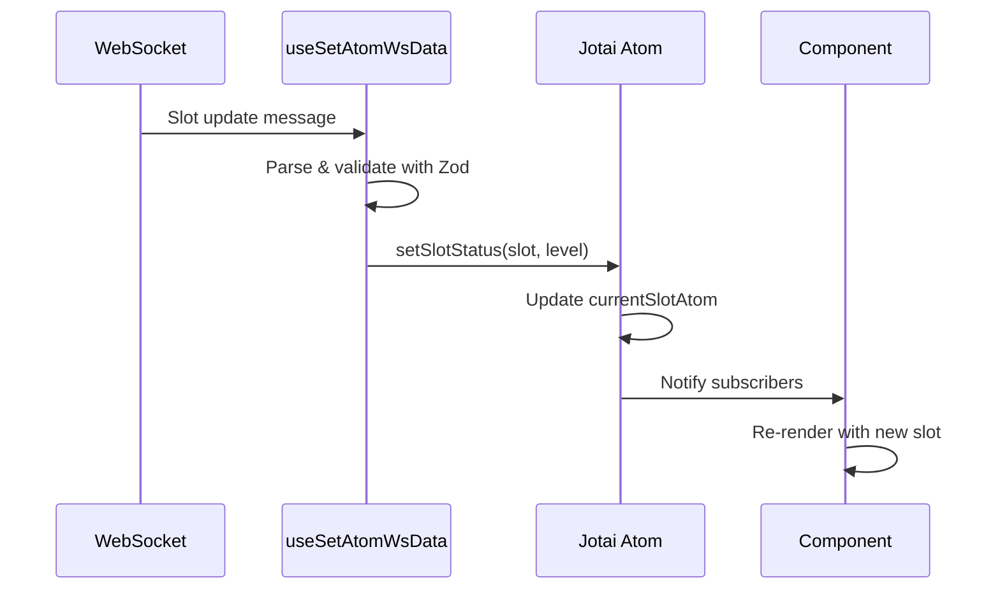

The Firedancer Frontend uses [Jotai](https://jotai.org/) for state management, providing atomic, composable state with automatic dependency tracking and minimal re-renders.

## Why Jotai?

Jotai offers several advantages for this real-time monitoring application:

<CardGroup cols={2}>
  <Card title="Atomic Updates" icon="atom">
    Fine-grained reactivity - only affected components re-render
  </Card>
  <Card title="No Boilerplate" icon="feather">
    Simple API with no reducers, actions, or providers
  </Card>
  <Card title="TypeScript Native" icon="code">
    Full type inference with excellent TypeScript support
  </Card>
  <Card title="Derived State" icon="diagram-project">
    Computed values automatically update when dependencies change
  </Card>
</CardGroup>

## Atom Organization

State atoms are organized across multiple files:

```bash
src/
├── atoms.ts              # Global application state
├── atomUtils.ts          # Custom atom utilities
├── api/
│   └── atoms.ts          # API/WebSocket-related state
└── features/
    └── */atoms.ts        # Feature-specific state
```

### Global Atoms (`src/atoms.ts`)

Core application state used across features:

```typescript src/atoms.ts
import { atom } from "jotai";
import { atomWithImmer } from "jotai-immer";

// Current slot number
export const currentSlotAtom = atom<number | undefined>(undefined);

// Current epoch information
export const epochAtom = atom(
  (get) => {
    const currentSlot = get(currentSlotAtom);
    const epochs = get(_epochsAtom);
    if (!epochs.length || currentSlot === undefined) return;

    return epochs.find(
      ({ start_slot, end_slot }) =>
        currentSlot >= start_slot && currentSlot <= end_slot,
    );
  },
  (_get, set, epoch: Epoch) => {
    set(_epochsAtom, (draft) => {
      const isDuplicate =
        draft.findIndex((e) => e.epoch === epoch.epoch) !== -1;
      if (!isDuplicate) {
        draft.push(epoch);
      }
    });
  },
);

// Validator identity public key
export const identityKeyAtom = atom<string | undefined>(undefined);

// Client type (Firedancer or Frankendancer)
export const clientAtom = atom(() => {
  const parsedClient = clientSchema.safeParse(
    (import.meta.env.VITE_VALIDATOR_CLIENT as string)?.trim(),
  );
  return parsedClient.error ? ClientEnum.Frankendancer : parsedClient.data;
});
```

### API Atoms (`src/api/atoms.ts`)

State managed by WebSocket messages:

```typescript src/api/atoms.ts
import { atom } from "jotai";

export const versionAtom = atom<string | undefined>(undefined);
export const clusterAtom = atom<string | undefined>(undefined);
export const commitHashAtom = atom<string | undefined>(undefined);
export const estimatedSlotDurationAtom = atom<number | undefined>(undefined);
export const estimatedTpsAtom = atom<number | undefined>(undefined);
export const skippedSlotsAtom = atom<number[] | undefined>(undefined);
```

## Atom Patterns

### Basic Read/Write Atoms

Simple state containers:

```typescript
import { atom } from "jotai";

// Read and write
const countAtom = atom(0);

// Usage in component
function Counter() {
  const [count, setCount] = useAtom(countAtom);
  return (
    <button onClick={() => setCount(count + 1)}>
      Count: {count}
    </button>
  );
}
```

### Read-Only Derived Atoms

Computed values that automatically update:

```typescript src/atoms.ts
// Derived from multiple atoms
export const leaderSlotsAtom = atom((get) => {
  const epoch = get(epochAtom);
  const pubkey = get(identityKeyAtom);

  if (!epoch || !pubkey) return;

  return getLeaderSlots(epoch, pubkey);
});

// Usage
function LeaderCount() {
  const leaderSlots = useAtomValue(leaderSlotsAtom);
  return <div>Leader Slots: {leaderSlots?.length ?? 0}</div>;
}
```

### Write-Only Action Atoms

Atoms for triggering updates without returning a value:

```typescript src/atoms.ts
// Write-only atom for side effects
export const setSlotStatusAtom = atom(
  null,
  (_, set, slot: number, level: SlotLevel) => {
    if (
      level === "completed" ||
      level === "optimistically_confirmed" ||
      level === "rooted"
    ) {
      set(currentSlotAtom, slot + 1);
    }
    set(slotStatusAtom, (draft) => {
      draft[slot] = level;
    });
  },
);

// Usage
function SlotProcessor() {
  const setSlotStatus = useSetAtom(setSlotStatusAtom);
  
  useEffect(() => {
    setSlotStatus(12345, "completed");
  }, []);
}
```

### Bi-Directional Atoms

Atoms with custom read and write logic:

```typescript src/atoms.ts
export const slotOverrideAtom = atom(
  (get) => get(_slotOverrideAtom),
  (get, set, slot: number | undefined) => {
    const epoch = get(epochAtom);
    if (!epoch) return;

    // Clamp slot to epoch boundaries
    const clampedSlot =
      slot === undefined
        ? undefined
        : clamp(
            getSlotGroupLeader(slot),
            epoch.start_slot,
            epoch.end_slot,
          );

    set(_slotOverrideAtom, clampedSlot);
  },
);
```

### Immer-Based Atoms

Mutable updates with `atomWithImmer` for complex state:

```typescript src/atoms.ts
import { atomWithImmer } from "jotai-immer";

// Peers stored as a record
export const peersAtom = atomWithImmer<Record<string, Peer>>({});

// Update action using Immer's draft API
export const updatePeersAtom = atom(null, (_, set, peers?: Peer[]) => {
  if (!peers?.length) return;

  set(peersAtom, (draft) => {
    for (const peer of peers) {
      if (draft[peer.identity_pubkey]) {
        // Immer allows "mutation"
        draft[peer.identity_pubkey] = merge(
          draft[peer.identity_pubkey],
          peer
        );
      } else {
        draft[peer.identity_pubkey] = peer;
      }
    }
  });
});
```

<Info>
  **Immer Integration**: `atomWithImmer` enables writing mutable-looking code that's actually immutable under the hood, perfect for complex nested state updates.
</Info>

### Atom Families

Dynamically created atoms indexed by parameters:

```typescript src/atoms.ts
import { atomFamily } from "jotai/utils";
import memoize from "micro-memoize";

// Atom family for slot-specific state
export const slotResponseAtomFamily = atomFamily((slot?: number) =>
  atom((get) => (
    slot !== undefined ? get(slotResponseAtom)[slot] : undefined
  )),
);

// Memoized atom factory for performance
export const getSlotStatus = memoize(
  (slot?: number) =>
    atom((get) =>
      slot !== undefined
        ? get(slotStatusAtom)[slot] || "incomplete"
        : "incomplete",
    ),
  { maxSize: 1_000 },
);

// Usage
function SlotStatus({ slot }: { slot: number }) {
  const status = useAtomValue(getSlotStatus(slot));
  return <div>Status: {status}</div>;
}
```

<Warning>
  **Memory Management**: Atom families can create many atoms. Clean them up when no longer needed using `.remove(param)` method.
</Warning>

## Custom Atom Utilities

The project includes custom atom factories in `src/atomUtils.ts`:

### Rate-Limited Atom

Throttle updates using `requestAnimationFrame`:

```typescript src/atomUtils.ts
import { atom } from "jotai";

export function rafAtom<T>(initialValue: T) {
  const baseAtom = atom(initialValue);
  let rafId: number | undefined = undefined;

  return atom(
    (get) => get(baseAtom),
    (_, set, value: T) => {
      if (rafId !== undefined) {
        cancelAnimationFrame(rafId);
      }

      rafId = requestAnimationFrame(() => {
        rafId = undefined;
        set(baseAtom, value);
      });
    },
  );
}
```

### Timeout-Keyed Atom

Track temporary states with automatic cleanup:

```typescript src/atomUtils.ts
export function keyTimeoutAtom(timeout: number = 60_000) {
  const baseAtom = atomWithImmer<
    Record<string | number | symbol, NodeJS.Timeout>
  >({});

  return (key: string | number | symbol | null | undefined) =>
    atom(
      (get) => {
        if (key == null) return false;
        return !!get(baseAtom)[key];
      },
      (_, set) => {
        if (key == null) return;

        const id = setTimeout(() => {
          set(baseAtom, (draft) => {
            delete draft[key];
          });
        }, timeout);

        set(baseAtom, (draft) => {
          if (draft[key]) {
            clearTimeout(draft[key]);
          }
          draft[key] = id;
        });
      },
    );
}
```

## State Flow Example

How state flows from WebSocket to UI:



### WebSocket → Atoms

Messages are parsed and update atoms:

```typescript src/api/useSetAtomWsData.ts
export function useSetAtomWsData() {
  const setCurrentSlot = useSetAtom(currentSlotAtom);
  const setEpoch = useSetAtom(epochAtom);
  const setIdentityKey = useSetAtom(identityKeyAtom);

  useServerMessages((msg) => {
    try {
      const { topic } = topicSchema.parse(msg);
      
      if (topic === "summary") {
        const { key, value } = summarySchema.parse(msg);
        switch (key) {
          case "identity_key":
            setIdentityKey(value);
            break;
          case "estimated_slot_duration_nanos":
            setEstimatedSlotDuration(value);
            break;
          // ... more cases
        }
      } else if (topic === "slot") {
        const { value } = slotSchema.parse(msg);
        setSlotStatus(value.publish.slot, value.publish.level);
      }
    } catch (e) {
      console.error("Failed to parse message", e);
    }
  });
}
```

### Atoms → Components

Components subscribe to atoms:

```tsx
import { useAtomValue } from "jotai";
import { currentSlotAtom, epochAtom, leaderSlotsAtom } from "@/atoms";

function ValidatorStatus() {
  const currentSlot = useAtomValue(currentSlotAtom);
  const epoch = useAtomValue(epochAtom);
  const leaderSlots = useAtomValue(leaderSlotsAtom);

  return (
    <Card>
      <CardHeader>Validator Status</CardHeader>
      <CardStat label="Current Slot" value={currentSlot} />
      <CardStat label="Epoch" value={epoch?.epoch} />
      <CardStat label="Leader Slots" value={leaderSlots?.length} />
    </Card>
  );
}
```

## Performance Considerations

### Memory Management

The app implements bounds checking to prevent unbounded memory growth:

```typescript src/atoms.ts
const slotCacheBounds = 1_000;

export const deleteSlotStatusBoundsAtom = atom(null, (get, set) => {
  const currentSlot = get(currentSlotAtom);
  const slot = get(slotOverrideAtom) ?? currentSlot;

  if (slot !== undefined) {
    set(slotStatusAtom, (draft) => {
      const cacheSlotMin = slot - slotCacheBounds / 2;
      const cacheSlotMax = slot + slotCacheBounds / 2;
      const cachedStatusSlots = Object.keys(draft);
      
      for (const cachedStatusSlot of cachedStatusSlots) {
        const numberVal = Number(cachedStatusSlot);
        if (!isNaN(numberVal) &&
            (numberVal < cacheSlotMin || numberVal > cacheSlotMax)) {
          delete draft[numberVal];
        }
      }
    });
  }
});
```

### Selective Subscriptions

Subscribe only to what you need:

```tsx
// ❌ Bad - subscribes to entire epoch object
const epoch = useAtomValue(epochAtom);
return <div>{epoch?.epoch}</div>;

// ✅ Better - create derived atom for just the epoch number
const epochNumberAtom = atom((get) => get(epochAtom)?.epoch);
const epochNumber = useAtomValue(epochNumberAtom);
return <div>{epochNumber}</div>;
```

### Throttling Updates

Throttle high-frequency updates:

```typescript src/api/useSetAtomWsData.ts
import { useThrottledCallback } from "use-debounce";

const setEstimatedTps = useSetAtom(estimatedTpsAtom);
const setDbEstimatedTps = useThrottledCallback(
  (value?: EstimatedTps) => {
    setEstimatedTps(value);
  },
  1000 // Update at most once per second
);
```

## Best Practices

<AccordionGroup>
  <Accordion title="Keep atoms small and focused">
    Each atom should represent a single piece of state. Don't store the entire app state in one atom.
  </Accordion>
  
  <Accordion title="Use derived atoms for computed values">
    Create read-only derived atoms instead of computing values in components. This enables better memoization and reduces re-renders.
  </Accordion>
  
  <Accordion title="Prefer atomWithImmer for complex state">
    Use `atomWithImmer` when updating nested objects or arrays. The mutable API is easier to work with.
  </Accordion>
  
  <Accordion title="Clean up atom families">
    When using atom families, remember to call `.remove(param)` when atoms are no longer needed.
  </Accordion>
  
  <Accordion title="Use write-only atoms for actions">
    Create write-only atoms for side effects and complex update logic. This keeps components simple.
  </Accordion>
</AccordionGroup>

## Next Steps

<CardGroup cols={2}>
  <Card title="WebSocket Integration" icon="signal" href="/architecture/websocket-integration">
    Learn how atoms are updated from WebSocket messages
  </Card>
  <Card title="Components" icon="cube" href="/architecture/components">
    See how components consume atom state
  </Card>
</CardGroup>