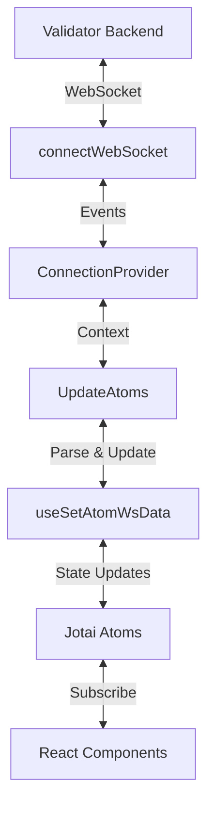

The Firedancer Frontend maintains a persistent WebSocket connection to the validator backend for real-time monitoring data. This architecture enables live updates with minimal latency.

## Connection Architecture

The WebSocket integration is structured in layers:



<Steps>
  <Step title="Connection Establishment">
    `connectWebSocket` creates and manages the WebSocket connection
  </Step>
  <Step title="Provider Context">
    `ConnectionProvider` wraps the app and provides connection state
  </Step>
  <Step title="Message Handling">
    `useSetAtomWsData` parses messages and updates atoms
  </Step>
  <Step title="Component Updates">
    Components reactively update when atoms change
  </Step>
</Steps>

## Connection Provider

The `ConnectionProvider` component establishes the WebSocket connection and manages its lifecycle:

```tsx src/api/ws/ConnectionProvider.tsx
import EventEmitter from "events";
import { useSetAtom } from "jotai";
import type { PropsWithChildren } from "react";
import { useCallback, useEffect, useState } from "react";
import connectWebSocket from "./connectWebSocket";
import type { ConnectionStatus } from "./types";
import { socketStateAtom } from "./atoms";
import { ZstdInit } from "@oneidentity/zstd-js/decompress";
import UpdateAtoms from "../UpdateAtoms";
import type { ConnectionContextType } from "./ConnectionContext";
import { ConnectionContext, defaultCtxValue } from "./ConnectionContext";

const VITE_WEBSOCKET_URL = import.meta.env.PROD
  ? null
  : (import.meta.env.VITE_WEBSOCKET_URL as string)?.trim();

export function ConnectionProvider({ children }: PropsWithChildren) {
  const [ctxValue, _setCtxValue] = useState(defaultCtxValue);

  // Auto-detect WebSocket URL
  const websocketUrl = VITE_WEBSOCKET_URL
    ? VITE_WEBSOCKET_URL
    : `${window.location.protocol.startsWith("https") ? "wss" : "ws"}://${window.location.hostname}:${window.location.port}/websocket`;

  const setSocketState = useSetAtom(socketStateAtom);

  useEffect(() => {
    if (!websocketUrl) {
      return;
    }

    const abortController = new AbortController();
    const { signal } = abortController;

    const emitter = new EventEmitter().setMaxListeners(1e3);

    const onMessage = (message: unknown) =>
      emitter.emit(messageEventType, message);
    
    const onConnectionStatusChanged = (connectionStatus: ConnectionStatus) => {
      updateContext({ connectionStatus });
      setSocketState(connectionStatus.socketState);
    };

    const disposePromise = (async () => {
      // Initialize Zstandard decompression
      const zstd = await ZstdInit();
      if (signal.aborted) return Promise.resolve(() => 0);

      const [sendMessage, dispose] = connectWebSocket(
        websocketUrl,
        onMessage,
        onConnectionStatusChanged,
        zstd,
      );

      updateContext({ sendMessage, emitter, isActive: true });
      return dispose;
    })();

    return () => {
      abortController.abort();
      void (async () => {
        emitter.removeAllListeners();
        (await disposePromise)();
      })();
    };
  }, [websocketUrl]);

  return (
    <ConnectionContext.Provider value={ctxValue}>
      <UpdateAtoms />
      {children}
    </ConnectionContext.Provider>
  );
}
```

**Key Features:**

- **Auto-detection**: Constructs WebSocket URL from current location
- **Compression**: Initializes Zstandard for message compression
- **Event Emitter**: Uses EventEmitter for message distribution
- **Cleanup**: Properly disposes connection on unmount

## WebSocket Connection

The low-level connection handler manages the WebSocket lifecycle:

```typescript src/api/ws/connectWebSocket.ts
import type { ClientMessage, ConnectionStatus } from "./types";
import { SocketState } from "./types";
import type { ZstdDec } from "@oneidentity/zstd-js/decompress";

const RECONNECT_DELAY = 3_000;

export default function connectWebSocket(
  url: string | URL,
  onMessage: (message: unknown) => void,
  onConnectionStatusChanged: (connectionStatus: ConnectionStatus) => void,
  zstd: ZstdDec,
) {
  let ws: WebSocket;
  let isDisposing = false;

  function connect() {
    onConnectionStatusChanged({ socketState: SocketState.Connecting });
    
    // Request compression if available
    ws = new WebSocket(url, ["compress-zstd"]);
    ws.binaryType = "arraybuffer";

    ws.onopen = function onopen() {
      if (this !== ws || isDisposing) return;
      onConnectionStatusChanged({ socketState: SocketState.Connected });
    };

    ws.onclose = function onclose() {
      if (this !== ws || isDisposing) return;
      
      onConnectionStatusChanged({ socketState: SocketState.Disconnected });
      
      // Auto-reconnect after delay
      setTimeout(connect, RECONNECT_DELAY);
    };

    const decoder = new TextDecoder();
    ws.onmessage = function onmessage(ev: MessageEvent<unknown>) {
      if (this !== ws || isDisposing || !zstd) return;
      
      try {
        const message = ev.data;
        let json = undefined;
        
        if (typeof message === "string") {
          // Uncompressed JSON
          json = JSON.parse(message) as unknown;
        } else if (message instanceof ArrayBuffer) {
          // Zstd-compressed binary
          json = JSON.parse(
            decoder.decode(
              zstd.ZstdStream.decompress(new Uint8Array(message))
            ),
          ) as unknown;
        }
        
        onMessage(json);
      } catch (e) {
        console.error(e);
      }
    };
  }

  connect();

  function sendMessage(message: ClientMessage) {
    if (isDisposing) return;

    if (ws && ws.readyState === WebSocket.OPEN) {
      ws.send(JSON.stringify(message));
    }
  }

  function dispose() {
    if (isDisposing) return;
    isDisposing = true;
    
    onConnectionStatusChanged({ socketState: SocketState.Disconnected });
    
    ws.onopen = null;
    ws.onclose = null;
    ws.onerror = null;
    ws.onmessage = null;
    ws.close();
  }

  return [sendMessage, dispose] as const;
}
```

**Connection Features:**

<CardGroup cols={2}>
  <Card title="Auto-Reconnect" icon="rotate">
    Automatically reconnects after 3 seconds if disconnected
  </Card>
  <Card title="Compression" icon="file-zipper">
    Supports Zstandard compression for reduced bandwidth
  </Card>
  <Card title="Binary Support" icon="binary">
    Handles both text and binary (compressed) messages
  </Card>
  <Card title="Clean Disposal" icon="trash">
    Properly cleans up event handlers and connection
  </Card>
</CardGroup>

## Message Parsing & Atom Updates

The `useSetAtomWsData` hook parses incoming messages and updates atoms:

```typescript src/api/useSetAtomWsData.ts
import { useAtom, useSetAtom } from "jotai";
import { useServerMessages } from "./ws/utils";
import { topicSchema, summarySchema, slotSchema } from "./entities";
import {
  setSlotStatusAtom,
  setSlotResponseAtom,
  updatePeersAtom,
} from "../atoms";

export function useSetAtomWsData() {
  const setVersion = useSetAtom(versionAtom);
  const setCluster = useSetAtom(clusterAtom);
  const setIdentityKey = useSetAtom(identityKeyAtom);
  const setSlotStatus = useSetAtom(setSlotStatusAtom);
  const updatePeers = useSetAtom(updatePeersAtom);
  const [epoch, setEpoch] = useAtom(epochAtom);

  useServerMessages((msg) => {
    try {
      // Parse message topic
      const { topic } = topicSchema.parse(msg);
      
      if (topic === "summary") {
        const { key, value } = summarySchema.parse(msg);
        switch (key) {
          case "version":
            setVersion(value);
            break;
          case "cluster":
            setCluster(value);
            break;
          case "identity_key":
            setIdentityKey(value);
            break;
          // ... more cases
        }
      } else if (topic === "slot") {
        const { key, value } = slotSchema.parse(msg);
        switch (key) {
          case "update":
          case "query":
            if (value) {
              setSlotResponse(value);
              handleSlotUpdate(value);
            }
            break;
          case "skipped_history":
            setSkippedSlots(value.sort());
            break;
        }
      } else if (topic === "peers") {
        const { value } = peersSchema.parse(msg);
        addToPeersBuffer(value);
      }
    } catch (e) {
      if (e instanceof ZodError) {
        console.error("Failed to parse message", e.issues);
      } else {
        console.error(e);
      }
    }
  });
}
```

### Message Topics

Messages are organized by topics:

<Tabs>
  <Tab title="summary">
    General validator information:
    - `version`: Validator version
    - `cluster`: Cluster name (mainnet-beta, testnet, etc.)
    - `identity_key`: Validator identity public key
    - `estimated_slot_duration_nanos`: Current slot time
    - `estimated_tps`: Transactions per second
    - `boot_progress`: Startup/catchup progress
  </Tab>
  
  <Tab title="slot">
    Slot-specific data:
    - `update`: Slot status update
    - `query`: Slot details response
    - `skipped_history`: List of skipped slots
    - `query_rankings`: Slot performance rankings
    - `live_shreds`: Real-time shred reception
  </Tab>
  
  <Tab title="epoch">
    Epoch information:
    - `new`: New epoch data (start/end slots, leader schedule, stakes)
  </Tab>
  
  <Tab title="peers">
    Network peer updates:
    - Peer additions
    - Peer updates (stake, vote state, etc.)
    - Peer removals
  </Tab>
  
  <Tab title="gossip">
    Gossip network stats:
    - `network_stats`: Push/pull message counts
    - `peers_size_update`: Peer table size
    - `view_update`: Gossip peer state changes
  </Tab>
</Tabs>

## Schema Validation

All messages are validated using Zod schemas:

```typescript src/api/entities.ts
import { z } from "zod";

// Topic schema
export const topicSchema = z.object({
  topic: z.enum(["summary", "slot", "epoch", "peers", "gossip", "block_engine"]),
});

// Summary message schema
export const summarySchema = z.object({
  topic: z.literal("summary"),
  key: z.enum([
    "version",
    "cluster",
    "identity_key",
    "estimated_slot_duration_nanos",
    "estimated_tps",
    // ... more keys
  ]),
  value: z.unknown(), // Type varies by key
});

// Slot message schema
export const slotSchema = z.object({
  topic: z.literal("slot"),
  key: z.enum(["update", "query", "skipped_history", "query_rankings"]),
  value: z.unknown(),
});
```

<Info>
  **Type Safety**: Zod schemas provide runtime validation and TypeScript type inference, ensuring message integrity.
</Info>

## Sending Messages

Components can send messages to the backend:

```tsx
import { useContext } from "react";
import { ConnectionContext } from "@/api/ws/ConnectionContext";

function SlotQuery({ slot }: { slot: number }) {
  const { sendMessage } = useContext(ConnectionContext);
  
  const handleQuerySlot = () => {
    sendMessage({
      topic: "slot",
      key: "query",
      value: { slot },
    });
  };
  
  return (
    <button onClick={handleQuerySlot}>
      Query Slot {slot}
    </button>
  );
}
```

## Connection State

Components can react to connection state changes:

```tsx
import { useAtomValue } from "jotai";
import { socketStateAtom } from "@/api/ws/atoms";
import { SocketState } from "@/api/ws/types";

function ConnectionIndicator() {
  const socketState = useAtomValue(socketStateAtom);
  
  return (
    <div>
      {socketState === SocketState.Connected && (
        <Badge color="green">Connected</Badge>
      )}
      {socketState === SocketState.Connecting && (
        <Badge color="yellow">Connecting...</Badge>
      )}
      {socketState === SocketState.Disconnected && (
        <Badge color="red">Disconnected</Badge>
      )}
    </div>
  );
}
```

## Performance Optimizations

### Message Throttling

High-frequency updates are throttled to prevent excessive re-renders:

```typescript src/api/useSetAtomWsData.ts
import { useThrottledCallback } from "use-debounce";

const setEstimatedTps = useSetAtom(estimatedTpsAtom);

// Throttle to at most once per second
const setDbEstimatedTps = useThrottledCallback(
  (value?: EstimatedTps) => {
    setEstimatedTps(value);
  },
  1000,
);
```

### Debounced Batching

Peer updates are batched and debounced:

```typescript src/api/useSetAtomWsData.ts
import { useDebouncedCallback } from "use-debounce";

const peersBuffer = useRef(new Map<string, Peer>());
const removePeersBuffer = useRef(new Map<string, PeerRemove>());

const dbFlushBuffer = useDebouncedCallback(
  () => {
    updatePeers([...peersBuffer.current.values()]);
    removePeers([...removePeersBuffer.current.values()]);
    peersBuffer.current.clear();
    removePeersBuffer.current.clear();
  },
  1_000,
  { maxWait: 1_000 },
);

const addToPeersBuffer = (peers: Peer[]) => {
  for (const peer of peers) {
    peersBuffer.current.set(peer.identity_pubkey, peer);
  }
  dbFlushBuffer();
};
```

### Compression

Messages use Zstandard compression, reducing bandwidth by ~70%:

```typescript
// Server sends compressed binary
const compressed = zstd.compress(JSON.stringify(message));
ws.send(compressed);

// Client decompresses
const decompressed = zstd.ZstdStream.decompress(new Uint8Array(message));
const json = JSON.parse(decoder.decode(decompressed));
```

## Error Handling

### Connection Errors

Auto-reconnect on connection loss:

```typescript
ws.onclose = function onclose() {
  console.debug(
    `Disconnected, reconnecting in ${RECONNECT_DELAY}ms`
  );
  
  onConnectionStatusChanged({ 
    socketState: SocketState.Disconnected 
  });
  
  setTimeout(connect, RECONNECT_DELAY);
};
```

### Parsing Errors

Graceful handling of malformed messages:

```typescript
try {
  const { topic } = topicSchema.parse(msg);
  // ... handle message
} catch (e) {
  if (e instanceof ZodError) {
    console.error("Invalid message format", e.issues);
  } else {
    console.error("Failed to process message", e);
  }
}
```

## Best Practices

<AccordionGroup>
  <Accordion title="Never block the message handler">
    Keep the message parsing logic fast. Use throttling/debouncing for expensive operations.
  </Accordion>
  
  <Accordion title="Validate all incoming data">
    Use Zod schemas to validate message structure before processing.
  </Accordion>
  
  <Accordion title="Handle disconnections gracefully">
    Show connection state to users and ensure auto-reconnection works.
  </Accordion>
  
  <Accordion title="Batch updates when possible">
    Group related updates together to minimize re-renders.
  </Accordion>
  
  <Accordion title="Clean up subscriptions">
    Remove event listeners and dispose connections on unmount.
  </Accordion>
</AccordionGroup>

## Next Steps

<CardGroup cols={2}>
  <Card title="State Management" icon="database" href="/architecture/state-management">
    Learn how WebSocket data updates Jotai atoms
  </Card>
  <Card title="API Reference" icon="book" href="/api/websocket-api">
    Explore the complete message API
  </Card>
</CardGroup>