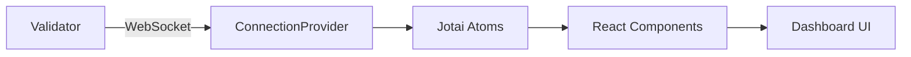

## What is Firedancer Frontend?

Firedancer Frontend is a powerful, real-time monitoring dashboard designed specifically for Firedancer and Frankendancer Solana validators. Built with React and modern web technologies, it provides comprehensive visibility into validator performance, network health, and transaction processing.

<Note>
This dashboard connects to your validator via WebSocket to provide live, streaming data updates with minimal latency.
</Note>

## Key Features

<CardGroup cols={2}>
  <Card title="Real-Time Monitoring" icon="chart-line">
    Live updates of validator status, slot processing, and network metrics through WebSocket connections
  </Card>
  <Card title="Performance Analytics" icon="gauge-high">
    Detailed insights into tile performance, transaction throughput (TPS), and CPU utilization
  </Card>
  <Card title="Transaction Tracking" icon="money-bill-transfer">
    Comprehensive transaction waterfall visualization, fee analysis, and compute unit tracking
  </Card>
  <Card title="Network Visualization" icon="network-wired">
    Gossip network health, peer connections, and stake distribution across the cluster
  </Card>
</CardGroup>

## Architecture Overview

The Firedancer Frontend is built with a modern, performant stack:

### Core Technologies

- **React 18**: Component-based UI with hooks and concurrent features
- **TanStack Router**: Type-safe routing with code splitting
- **Jotai**: Atomic state management for WebSocket data
- **Vite**: Fast build tooling and hot module replacement
- **TypeScript**: Type safety throughout the application

### Data Flow

The application establishes a WebSocket connection to your validator (configured via `src/api/ws/ConnectionProvider.tsx:27`) and streams real-time data updates. Data is validated using Zod schemas and stored in Jotai atoms for efficient reactivity.

### Key Components

**ConnectionProvider** (`src/api/ws/ConnectionProvider.tsx`)
Manages WebSocket lifecycle, message handling, and connection status. Automatically reconnects on disconnection and handles compressed data streams using Zstd.

**State Management** (`src/atoms.ts`, `src/api/atoms.ts`)
Centralized state using Jotai atoms for validator metrics, slot data, gossip information, and UI state.

**Type Safety** (`src/api/entities.ts`)
Comprehensive Zod schemas ensure runtime validation of all incoming data from the validator, covering:
- Summary metrics (TPS, slot status, balances)
- Epoch data (stake distribution, leader schedule)
- Gossip network stats
- Slot-level transaction details
- Tile performance metrics

## Dashboard Views

### Overview Dashboard
The main view (`src/routes/index.tsx`) displays:
- Validator status and uptime
- Real-time TPS (total, vote, non-vote)
- Slot timeline with skip rates
- Transaction waterfall visualization
- Tile performance metrics
- Network traffic

### Slot Details
Drills down into individual slots with:
- Transaction-level data
- Compute unit usage
- Fee breakdown (priority fees, base fees, tips)
- Execution timing
- Scheduler statistics

### Gossip Network
Monitors network health:
- Connected peers and stake
- Push/pull message statistics
- Traffic throughput by peer
- Storage and message stats

### Leader Schedule
Visualizes upcoming leader slots and historical performance.

## Dual Client Support

The dashboard supports both Firedancer and Frankendancer clients. The client is auto-detected via the `VITE_VALIDATOR_CLIENT` environment variable, which customizes:

- Branding and logos
- Client-specific tile types (e.g., `resolv` vs `resolh`, `poh` vs `pohh`)
- Feature availability based on client capabilities

## Data Visualization

The dashboard uses several specialized visualization libraries:

- **AG Grid**: High-performance data tables for transactions and peers
- **uPlot**: Ultra-fast time-series charts for metrics
- **Nivo**: Beautiful charts for distributions and breakdowns
- **Custom Canvas**: Hand-crafted visualizations for Sankey diagrams and waterfalls

## Performance Considerations

Built for production validator monitoring:

- **Virtualized Lists**: Handles thousands of rows with react-virtuoso
- **Memoization**: Aggressive memoization with micro-memoize
- **Efficient Updates**: Immer-based immutable updates
- **Code Splitting**: Route-based lazy loading
- **WebSocket Compression**: Zstd compression reduces bandwidth

## Next Steps

<CardGroup cols={2}>
  <Card title="Installation" icon="download" href="/installation">
    Set up the development environment and install dependencies
  </Card>
  <Card title="Quick Start" icon="rocket" href="/quickstart">
    Get your dashboard running in minutes
  </Card>
</CardGroup>